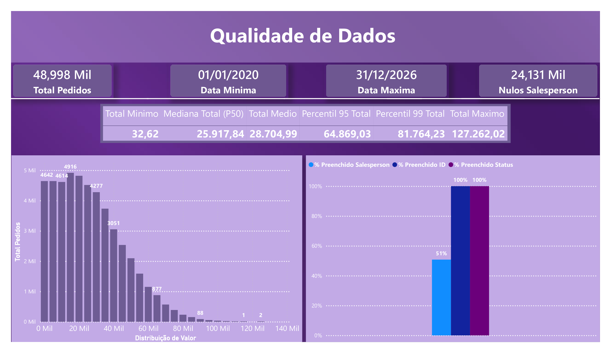
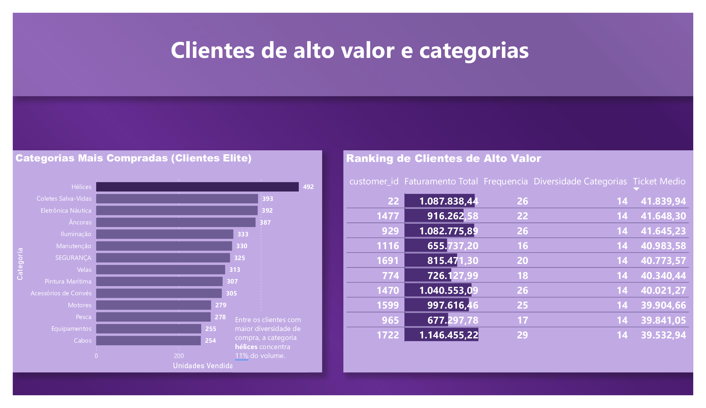
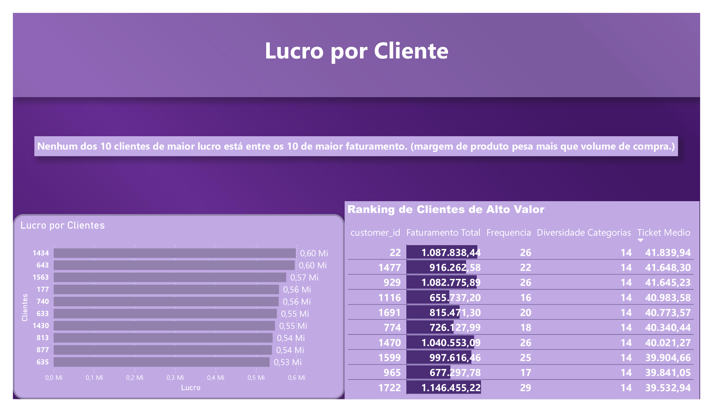
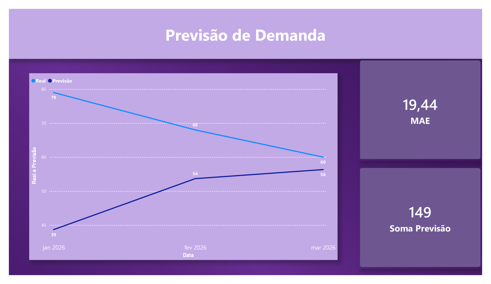
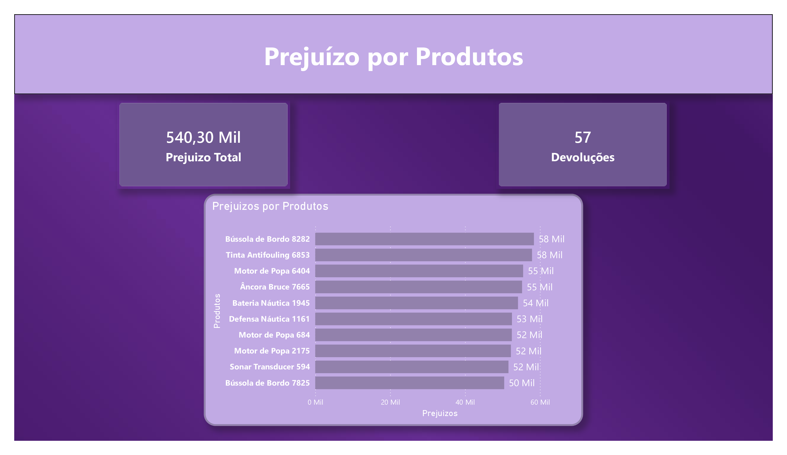

# 📊 Indicium Data Challenge


Resolução do case técnico de dados da Indicium (LH Nautical). O projeto implementa um pipeline de dados ponta a ponta: modelagem automática de schema a partir de CSVs brutos, ingestão em PostgreSQL, análise exploratória de qualidade de dados, análises de negócio em SQL avançado, dois modelos de machine learning (previsão de demanda e sistema de recomendação) e um dashboard interativo em Power BI para comunicação dos insights.

**Repositório:** [github.com/rlemos-dev/indicium-data-challenge](https://github.com/rlemos-dev/indicium-data-challenge)

---

## 📑 Sumário

- [Visão Geral](#-visão-geral)
- [Arquitetura do Projeto](#️-arquitetura-do-projeto)
- [Stack Utilizada](#-stack-utilizada)
- [Principais Achados](#-principais-achados)
- [Dashboard](#-dashboard)
- [Como Executar](#-como-executar)
- [Estrutura de Pastas](#-estrutura-de-pastas)
- [Autor](#-autor)

---

## 🔎 Visão Geral

O desafio simula o cenário de uma empresa (LH Nautical) cujo ERP só disponibiliza dados brutos via CSV, sem acesso direto ao banco. A partir disso, o projeto resolve, em sequência:

1. **Confiabilidade dos dados** — a tabela `orders` pode ser usada para decisões de negócio? (EDA)
2. **Modelagem** — como transformar CSVs soltos em um schema relacional consistente?
3. **Ingestão** — como carregar tudo em um banco de produção sem duplicar dados?
4. **Negócio** — quem são os clientes mais valiosos, o que compram, e quando a loja física vende mais?
5. **Ciência de dados** — dá pra prever a demanda futura de um produto? Dá pra recomendar produtos com base em comportamento de compra?
6. **Comunicação** — como apresentar tudo isso de forma visual e acionável para a diretoria?

Cada etapa acima corresponde a uma pasta do repositório, descrita em detalhe abaixo.

---

## 🏗️ Arquitetura do Projeto

O repositório foi organizado para refletir as etapas lógicas de um projeto de engenharia e ciência de dados no mundo real:

```
indicium-data-challenge/
├── 01_data_pipeline/
│   ├── generate_schema.py
│   ├── schema.sql
│   └── load_database.py
├── 02_sql_analysis/
│   ├── 01_eda_orders.sql
│   ├── 02_categoria_elite.sql
│   ├── 03_vendas_por_dia.sql
│   ├── 04_prejuizo_produto.sql
│   └── 05_lucro_cliente.sql
├── 03_demand_forecast/
│   └── previsao_vendas.py
├── 04_recommendation_system/
│   └── recomendacao_produtos.py
├── 05_dashboard/
│   └── Dashboard_Indicium.pbix
├── docs/
│   └── Relatorio_Tecnico_LH_Nautical.pdf
├── requirements.txt
├── .gitignore
└── README.md
```

### 📁 `01_data_pipeline` — Engenharia de Dados & Modelagem

Automação da criação e carga do banco de dados relacional a partir dos CSVs brutos fornecidos pelo ERP.

- **`generate_schema.py`** — Script em Python 3 puro (sem bibliotecas externas de dados, conforme exigido pelo desafio) que percorre recursivamente um diretório de CSVs, infere o tipo de cada coluna (`INTEGER`, `NUMERIC`, `BOOLEAN`, `DATE`, `TIMESTAMP`, `VARCHAR`) e gera automaticamente os comandos `CREATE TABLE` para todas as tabelas. Colunas identificadoras (CPF, CNPJ, telefone, CEP, código de barras) são sempre forçadas para `VARCHAR`, mesmo quando parecem numéricas, evitando perda de zeros à esquerda ou tentativa indevida de operação aritmética sobre um identificador.
- **`schema.sql`** — Arquivo DDL final gerado pelo script acima, com **24 tabelas** cobrindo todo o modelo de dados do ERP (clientes, pedidos, itens, pagamentos, produtos, estoque, devoluções, fornecedores, entre outras).
- **`load_database.py`** — Script de carga (ELT) utilizando `psycopg2`. Cria o banco e as tabelas caso não existam, e usa o comando `COPY ... FROM STDIN` do PostgreSQL para ingestão em alta performance (muito mais rápido que `INSERT` linha a linha). O script é **idempotente**: antes de carregar cada tabela, verifica se ela já possui registros, evitando duplicação de dados caso seja executado mais de uma vez.

### 📁 `02_sql_analysis` — Análise de Negócios

Resolução de problemas de negócio utilizando SQL avançado (CTEs, window functions, funções estatísticas e geração de séries temporais).

- **`01_eda_orders.sql`** — Análise exploratória da tabela `orders`: volumetria (48.998 pedidos), intervalo de datas, completude por coluna (identificando ~49% de nulos em `salesperson_id`), e detecção de outliers na coluna `total` via média, mediana, desvio padrão e percentis (P95/P99).
- **`02_categoria_elite.sql`** — Consulta analítica com CTEs para identificar os 10 clientes de maior ticket médio entre aqueles com diversidade de compra igual ou superior a 13 categorias distintas ("clientes de elite"), e qual categoria de produto concentra o maior volume de itens comprados por esse grupo.
- **`03_vendas_por_dia.sql`** — Análise temporal utilizando `generate_series` para criar uma dimensão de calendário contínua, garantindo que dias sem nenhuma venda no canal físico (`pos`) sejam contabilizados como zero no cálculo da média — em vez de simplesmente ignorados, o que infuiria os resultados.
- **`04_prejuizo_produto.sql`** — Ranking dos produtos com maior valor total de prejuízo, calculado a partir das devoluções registradas (`returns`/`return_items`), cruzando com `product_variants` e `products` para identificar o produto de origem de cada item devolvido.
- **`05_lucro_cliente.sql`** — Ranking dos clientes com maior lucro acumulado (receita menos custo, via `unit_price - cost_price` por item), complementando o ranking de faturamento bruto obtido em `02_categoria_elite.sql` e revelando que os dois grupos de clientes (maior faturamento vs. maior lucro) **não se sobrepõem**.

### 📁 `03_demand_forecast` — Ciência de Dados / Séries Temporais

- **`previsao_vendas.py`** — Extração de dados diretamente do PostgreSQL via SQLAlchemy para construir um modelo baseline de previsão de demanda mensal (média móvel de 3 meses) para um produto específico, com série completada para incluir meses sem venda (`reindex` + `fill_value=0`), separação temporal correta entre treino/teste (sem data leakage) e validação através da métrica MAE (`scikit-learn`).

### 📁 `04_recommendation_system` — Machine Learning

- **`recomendacao_produtos.py`** — Sistema de recomendação item-a-item baseado em filtragem colaborativa. Constrói uma matriz de interação cliente-produto (`pandas.crosstab`) a partir do histórico de compras e calcula a similaridade entre produtos via `cosine_similarity` (`scikit-learn`), retornando o Top 5 de produtos mais similares a um item de referência.

### 📁 `05_dashboard` — Comunicação de Resultados

- **`Dashboard_Indicium.pbix`** — Dashboard interativo em Power BI com 7 páginas, consolidando visualmente todos os resultados das etapas anteriores. Ver seção [Dashboard](#-dashboard) abaixo para detalhes de cada página.

### 📁 `docs`

- **`Relatorio_Tecnico_LH_Nautical.pdf`** — Relatório técnico consolidado, trazendo cenário, código, resultados e diagnóstico/interpretação de negócio para cada uma das etapas do desafio.

---

## 🛠️ Stack Utilizada

| Categoria | Ferramentas |
|---|---|
| Linguagem | Python 3.13 |
| Banco de dados | PostgreSQL |
| Conexão / ORM | psycopg2, SQLAlchemy |
| Análise de dados | pandas |
| Machine Learning | scikit-learn (`cosine_similarity`, `mean_absolute_error`) |
| Visualização | Power BI Desktop |
| Versionamento | Git / GitHub |

---

## 💡 Principais Achados

- A tabela `orders` é **utilizável para análises**, mas não está pronta para decisões críticas sem tratamento prévio: cerca de **49,25% dos registros** não têm vendedor atribuído (`salesperson_id` nulo).
- Os clientes de maior ticket médio e diversidade de categorias (≥13 categorias distintas) concentram **11% do volume de compras** na categoria **Hélices**.
- **Nenhum dos 10 clientes de maior lucro acumulado aparece entre os 10 de maior faturamento** — margem de produto pesa mais que volume de compra na hora de identificar os clientes mais estratégicos.
- Não há um dia da semana com sazonalidade forte de vendas no canal físico — a variação entre o melhor e o pior dia fica em torno de apenas **1,5 ponto percentual** sobre o total.
- Os produtos "Bússola de Bordo 8282" e "Tinta Antifouling 6853" concentram os maiores valores de **prejuízo por devolução** (~R$ 58 mil cada).
- O modelo baseline de previsão de demanda (média móvel de 3 meses) apresentou **MAE de 19,44 unidades** no 1º trimestre de 2026, reagindo com atraso a uma tendência real de queda na demanda — uma limitação esperada de modelos que não capturam tendência/sazonalidade.

---

## 📈 Dashboard

O `Dashboard_Indicium.pbix` está organizado em 7 páginas:

1. **Qualidade dos Dados** — KPIs de volumetria, completude por coluna e distribuição estatística da coluna `total` (identificação de outliers).
2. **Clientes de Alto Valor e Categorias** — ranking dos 10 clientes de elite por ticket médio e as categorias mais compradas por esse grupo.
3. **Lucro por Cliente** — ranking dos 10 clientes de maior lucro acumulado, comparado lado a lado com o ranking de faturamento.
4. **Análise Semanal** — vendas médias por dia da semana no canal físico, considerando corretamente os dias sem venda.
5. **Prejuízo por Produto** — ranking dos produtos com maior valor de devolução.
6. **Previsão de Demanda** — real vs. previsto para o 1º trimestre de 2026, com métrica de erro (MAE).
7. **Similaridade de Produtos** — Top 5 de recomendações para um produto de referência, baseado em comportamento de compra.

---

## 🚀 Como Executar

Para reproduzir este ambiente na sua máquina local:

### 1. Clone o repositório

```bash
git clone https://github.com/rlemos-dev/indicium-data-challenge.git
cd indicium-data-challenge
```

### 2. Crie um ambiente virtual e instale as dependências

```bash
python -m venv venv
source venv/bin/activate      # Linux/Mac
venv\Scripts\activate         # Windows

pip install -r requirements.txt
```

### 3. Configure os dados (não inclusos no repositório)

- Crie uma pasta local para armazenar os arquivos `.csv` fornecidos no desafio.
- *Atenção: por questões de segurança e boas práticas (conforme o `.gitignore`), os arquivos de dados brutos não foram subidos para o GitHub.*

### 4. Gere o schema a partir dos CSVs

```bash
cd 01_data_pipeline
python generate_schema.py
```

Isso vai ler todos os `.csv` do diretório configurado e gerar o arquivo `schema.sql` com o DDL de todas as tabelas.

### 5. Suba o banco de dados

- Certifique-se de ter o PostgreSQL rodando localmente (porta padrão `5432`).
- Ajuste as credenciais (`host`, `porta`, `usuário`, `senha`) no início do arquivo `load_database.py`.

```bash
python load_database.py
```

Esse script cria o banco (se não existir), executa o `schema.sql` e carrega todos os CSVs nas tabelas correspondentes via `COPY`, sem duplicar dados em execuções repetidas.

### 6. Rode as análises de negócio em SQL

Os arquivos em `02_sql_analysis/` podem ser executados diretamente no seu client SQL preferido (DBeaver, pgAdmin, psql) ou importados como consultas nativas no Power BI.

### 7. Rode os modelos de ciência de dados

```bash
cd ../03_demand_forecast
python previsao_vendas.py

cd ../04_recommendation_system
python recomendacao_produtos.py
```

### 8. Explore o dashboard

Abra `05_dashboard/Dashboard_Indicium.pbix` no Power BI Desktop. Se optar por reconectar as fontes de dados (em vez de usar o arquivo já carregado), ajuste a string de conexão do PostgreSQL nas configurações da fonte de dados do próprio Power BI.

## 📈 Dashboard

O `Dashboard_Indicium.pbix` está organizado em 7 páginas:

### 1. Qualidade dos Dados


### 2. Clientes de Alto Valor e Categorias


### 3. Lucro por Cliente


### 4. Análise Semanal


### 5. Prejuízo por Produto


### 6. Previsão de Demanda


### 7. Similaridade de Produtos


---

## 📁 Estrutura de Pastas

```
indicium-data-challenge/
├── 01_data_pipeline/
│   ├── generate_schema.py       # Gera o schema.sql a partir dos CSVs
│   ├── schema.sql                # DDL das 24 tabelas
│   └── load_database.py          # Carga idempotente via COPY
├── 02_sql_analysis/
│   ├── 01_eda_orders.sql
│   ├── 02_categoria_elite.sql
│   ├── 03_vendas_por_dia.sql
│   ├── 04_prejuizo_produto.sql
│   └── 05_lucro_cliente.sql
├── 03_demand_forecast/
│   └── previsao_vendas.py
├── 04_recommendation_system/
│   └── recomendacao_produtos.py
├── 05_dashboard/
│   └── Dashboard_Indicium.pbix
├── docs/
│   └── Relatorio_Tecnico_LH_Nautical.pdf
├── requirements.txt
├── .gitignore
└── README.md
```

---

## 👤 Autor

**Rafael Silva Lemos Ferreira**

Projeto desenvolvido para o processo seletivo técnico da Indicium.

[GitHub](https://github.com/rlemos-dev) · [Repositório do projeto](https://github.com/rlemos-dev/indicium-data-challenge)
